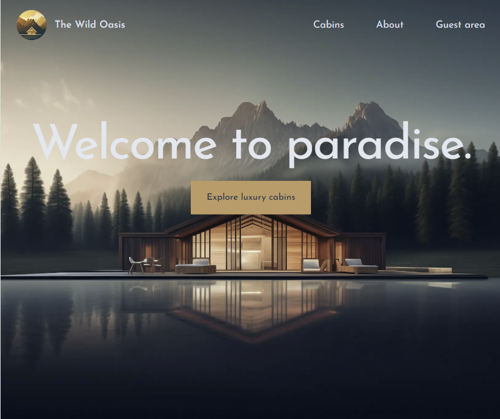
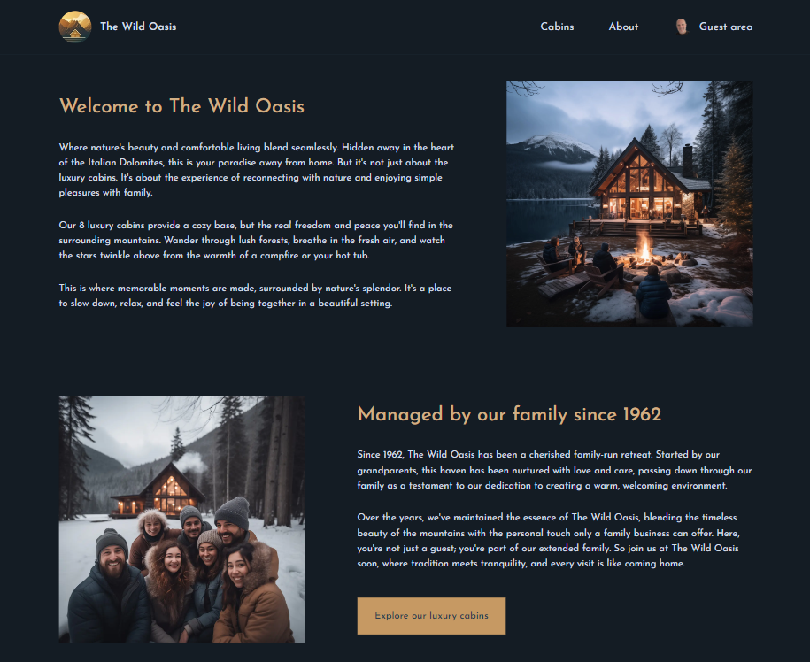
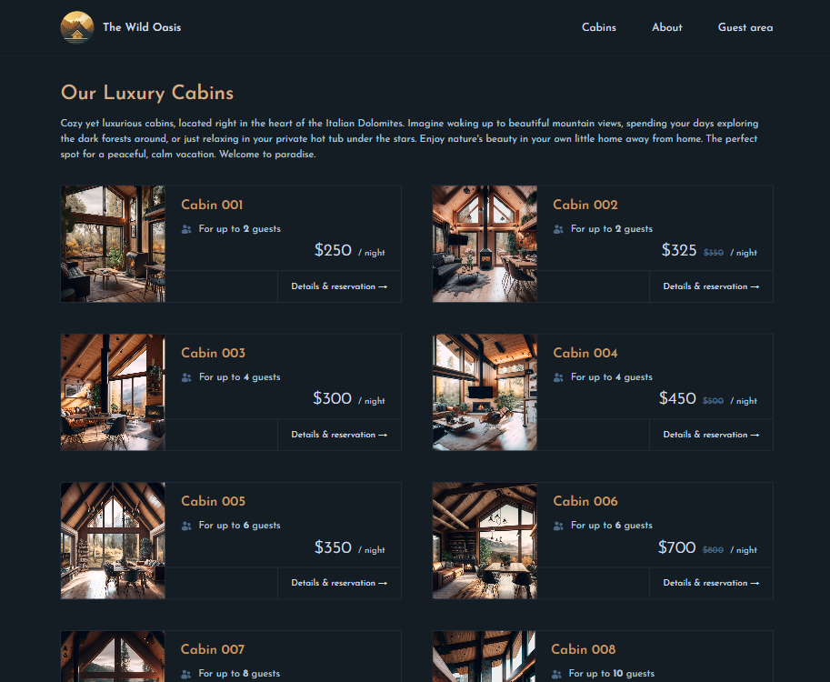
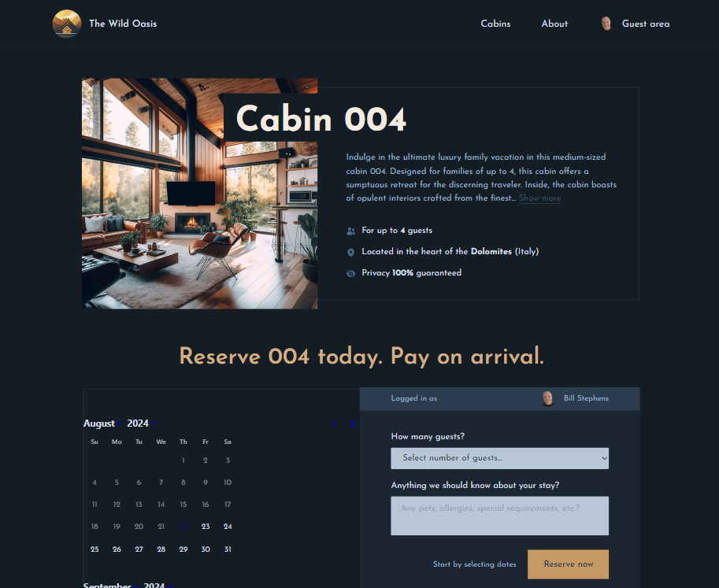
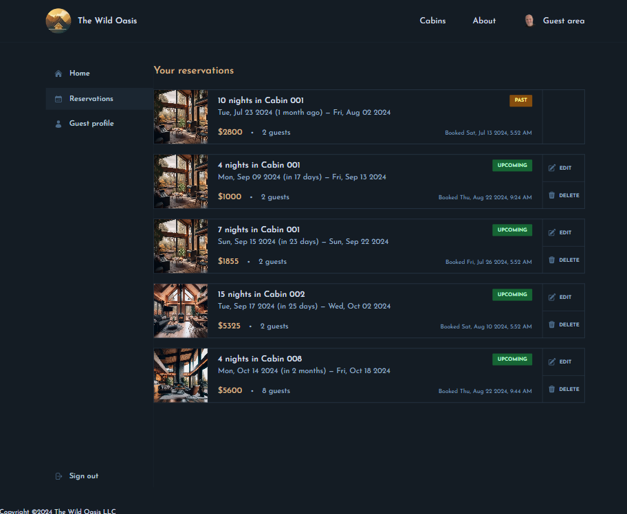
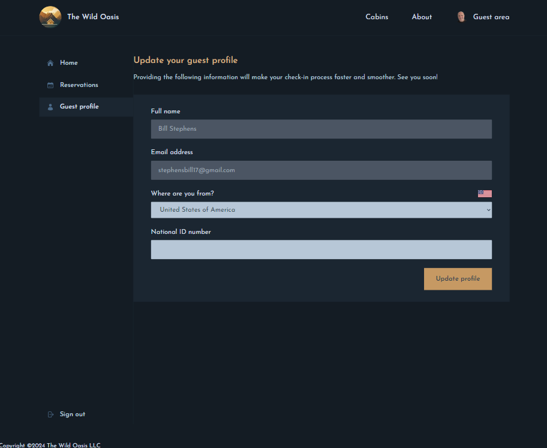

# Wild Oasis - NextJS 

## Description

A full stack application for a fictional resort - The Wild Oasis.  Built with NextJS, React, Supabase, and Next-Auth.  Create a user profile with avatar and Login. View the various cabins, make vacation reservations, update/delete reservations. 

  
### App Screenshot

  
  ## Table of Contents
  
  - [Installation](#installation)
  - [Usage](#usage)
  - [License](#license)
  - [Contributing](#contributing)
  - [Tests](#tests)
  - [Questions](#questions)
  
  ## Installation
  
  npm install
  
  ## Usage
  
  npm run dev

  ## License
This application is covered under the MIT License.
 For more information: https://opensource.org/licenses/MIT
  
  ## Contributing
  N/A
  
  ## Tests
  N/A

  ## Questions
  Contact Info 
  GitHub user name: BillStephens2022 
  Link to GitHub profile: https://github.com/BillStephens2022 
  Email: stephensbill17@gmail.com

### App Screenshot

